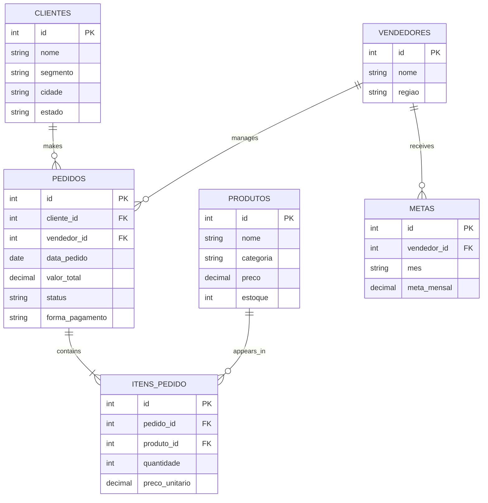

# 🗄️ Database

## Overview

The project uses a relational database that simulates the operation of a retail company.

The database stores information about customers, products, salespeople, orders, order items, and sales targets. Its structure allows SQL analyses involving sales performance, customer behavior, product results, and regional performance.

---

## Database Tables

| Table | Description |
|---|---|
| `clientes` | Stores customer information and customer segments |
| `produtos` | Stores products, categories, prices, and inventory |
| `vendedores` | Stores salesperson information and region |
| `pedidos` | Stores sales orders and payment information |
| `itens_pedido` | Stores the products included in each order |
| `metas` | Stores monthly sales targets for each salesperson |

---

## Main Relationships

| Primary Table | Relationship | Related Table |
|---|---|---|
| `clientes` | One customer can have many orders | `pedidos` |
| `vendedores` | One salesperson can be responsible for many orders | `pedidos` |
| `pedidos` | One order can contain many items | `itens_pedido` |
| `produtos` | One product can appear in many order items | `itens_pedido` |
| `vendedores` | One salesperson can have multiple monthly targets | `metas` |

---

## Primary Keys

| Table | Primary Key |
|---|---|
| `clientes` | `id` |
| `produtos` | `id` |
| `vendedores` | `id` |
| `pedidos` | `id` |
| `itens_pedido` | `id` |
| `metas` | `id` |

---

## Foreign Keys

| Table | Foreign Key | References |
|---|---|---|
| `pedidos` | `cliente_id` | `clientes.id` |
| `pedidos` | `vendedor_id` | `vendedores.id` |
| `itens_pedido` | `pedido_id` | `pedidos.id` |
| `itens_pedido` | `produto_id` | `produtos.id` |
| `metas` | `vendedor_id` | `vendedores.id` |

---

## Entity Relationship Diagram



---

## Business Rules

- Each order must be associated with one customer.
- Each order must be assigned to one salesperson.
- An order can contain one or more products.
- The subtotal of an order item is calculated as:

```text
quantity × unit price
```

- Only delivered orders are considered in completed revenue analyses.
- Cancelled orders are excluded from realized revenue.
- Sales targets are compared with delivered order revenue.
- Customer segments include retail, corporate, and government.
- Salespeople are grouped by region.

---

## Data Model Purpose

This database model supports analyses such as:

- Total revenue
- Revenue by customer segment
- Revenue by region
- Salesperson target achievement
- Product and category performance
- Payment method analysis
- Order cancellation analysis
- Average order value
- Highest-value orders
