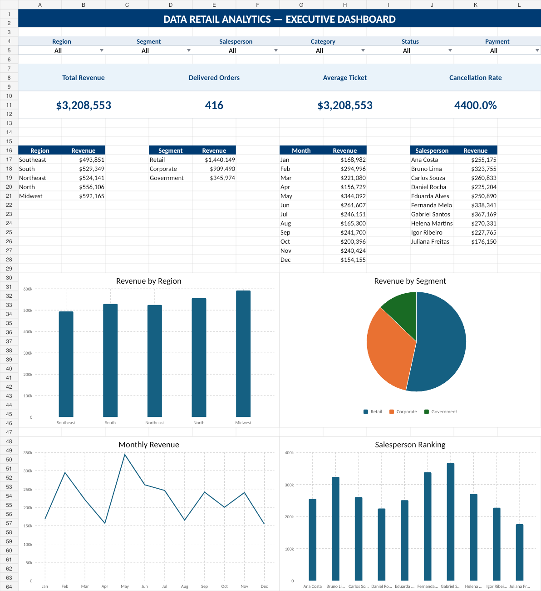

# 📊 Excel Analysis

## Overview

This folder contains the Excel analysis developed for the Data Retail Analytics project.

The objective is to transform the retail sales data into clear business indicators, interactive analyses, and visual dashboards that support decision-making.

---

## Excel Skills Demonstrated

- Data cleaning and preparation
- Excel Tables
- Pivot Tables
- Pivot Charts
- Slicers
- Conditional Formatting
- KPI development
- Dashboard design
- Business analysis

---

## Main KPIs

The Excel dashboard includes the following indicators:

- Total Revenue
- Average Order Value
- Delivered Orders
- Cancelled Orders
- Cancellation Rate
- Best-Selling Product
- Top Salesperson
- Best-Performing Region

---

## Dashboard Analyses

The dashboard supports analyses such as:

- Revenue by region
- Revenue by customer segment
- Sales by product category
- Salesperson performance
- Payment method distribution
- Cancellation analysis
- Monthly sales evolution
- Product performance

---

## Interactive Features

The dashboard uses interactive filters to allow users to analyze the data by:

- Region
- Salesperson
- Customer segment
- Product category
- Payment method
- Order status
- Period

---

## Files

| File | Description |
|---|---|
| `dataretail_dashboard.xlsx` | Excel workbook containing the data analysis and dashboard |
| `dashboard_preview.png` | Preview image of the final dashboard |

---

## Business Value

The Excel dashboard enables stakeholders to quickly identify:

- Sales trends
- High-performing regions
- Salespeople below or above target
- Products with stronger demand
- Customer segments with higher revenue
- Payment methods with higher cancellation rates

---

## Status

🚧 Dashboard development in progress.

---

# Dashboard Preview

